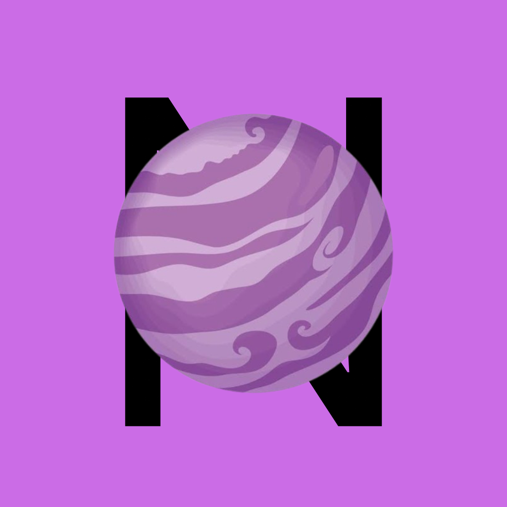

# 🪐 Nebula Game Engine

<p align="center">
  
</p>

A lightweight 2D/3D game engine written in C++.

## Features

- 🎮 2D Rendering
- 🌌 3D Rendering
- ⌨️ Input System
- 🎵 Audio System
- 📦 Asset Management
- ⚡ Physics System
- 🖥️ Windows Support
- 🍎 macOS Support
- 🤖 Android Support

## Project Structure

```text
Engine/
├── Core/
├── Renderer/
├── Scene/
├── Input/
├── Assets/
├── Physics/
└── Audio/
```

## Build

```bash
mkdir build
cd build
cmake ..
cmake --build .
```

## License

MIT License

---

Made with ❤️ using C++
